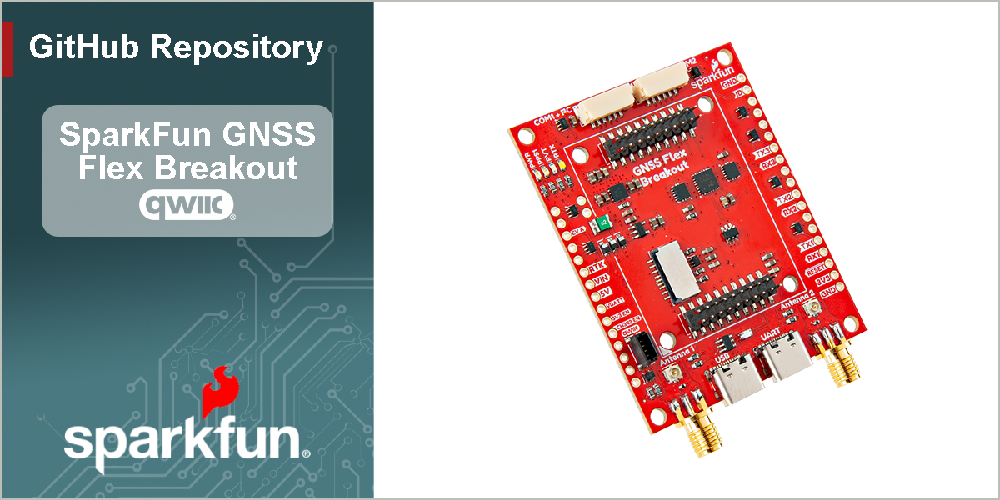

SparkFun GNSS Flex Breakout
========================================

[*SparkFun GNSS Flex Breakout (GPS-28962)*](https://www.sparkfun.com/sparkfun-gnss-flex-breakout.html)

The [SparkFun GNSS Flex breakout](https://www.sparkfun.com/sparkfun-gnss-flex-breakout.html) is a *carrier board* for our GNSS Flex modules. In its simplest form, the GNSS Flex Breakout board provides access to all of the interfaces from a GNSS Flex module.

- Need access to all those UART pins? The Breakout provides that.
- Want to communicate with the GNSS directly over USB? You can do that too, if the GNSS module supports USB.

The GNSS Flex Breakout comes populated with two sets of 2x10 pin, 2mm pitch male headers for attaching a GNSS Flex module. With these headers, the GNSS Flex system is designed to be modular so that boards are pin-compatible for upgrades and can be easily swapped for repairs. Depending on the capabilities of the GNSS Flex module that is connected, these pins will breakout the USB, UART (x4), I^2^C, and SD card interfaces for the GNSS receiver along with any PPS (x2) or event (x2) signals, using a standardized pin out.

By default, the CH342 USB-to-Serial converter chip is connected to both the GNSS `UART1` and `UART2` interfaces. When you connect the `UART` USB port to your computer and install the driver, those two UART interfaces will appear as COM ports. If you need dedicated access to the `UART1` or `UART2` breakout pins, or want to use either of the JST connectors, you will need to disable the CH342. On this board, we have made this simple; just pull the `CH342 EN` breakout pin `LOW` or connect it to `GND`. Otherwise, there is also a `CH342 EN` jumper you can solder instead.

We have also included two 6-pin JST connectors, same as the ones used on Pixhawk flight controllers. The JST connectors allow you to: connect the GNSS to a Pixhawk; or connect a radio to the GNSS to transfer (e.g.) RTCM correction data. There are four LEDs indicators for power to the board and the `PPS1`, `PVT`, and `RTK` signals from the GNSS Flex module. Power can be provided by any or all of: the USB connectors or the `VIN` breakout pin. By default, Pin 1 of the JST connectors provides 5V output. But jumpers on the board allow the voltage to be changed to 3.3V. Or you can isolate the other power sources and connect an external 5V power input on Pin 1 instead. It is up to you.

> [!IMPORTANT]
> Depending on the GNSS Flex module, this product will likely require an external antenna:
>
> - Be sure to check out the hookup guide for more information on the GNSS Flex module.
> - Users can also find [GNSS Antennas](https://www.sparkfun.com/gnss/gnss-antennas.html) in our catalog.
>
> Users will have two options for connecting an external GNSS antenna to their GNSS receiver.
>
> - The GNSS Flex modules will usually come with a U.FL connector for external antenna.
> - For a sturdier connection, an SMA connector is available on the SparkFun GNSS Flex Breakout that is bridged to an U.FL connector. Users simply need to jumper the U.FL connectors on both the SparkPNT GNSS Flex module and SparkFun GNSS Flex Breakout with a short U.FL cable.

Documentation
--------------
- **[Hookup Guide (mkdocs)](http://docs.sparkfun.com/SparkFun_GNSS_Flex_System/)** - A hookup guide for the entire ecosystem of SparkFun GNSS Flex carrier boards and SparkPNT GNSS Flex modules, hosted by GitHub pages. 
   

Repository Contents
-------------------
- **[/docs](/docs/)** - Online documentation files
  - [/assets](/docs/assets/) - Assets files
    - [/3d_model](/docs/assets/3d_model/) - Files for the 3D models
      - [/3D CAD Model](/docs/assets/3d_model/cad_model.step) (.step)
    - [/board_files](/docs/assets/board_files/) - Files for the product design
      - [KiCad Design Files](/docs/assets/board_files/kicad_files.zip) (.zip)
      - [Schematic](/docs/assets/board_files/schematic.pdf) (.pdf)
      - [Dimensions](/docs/assets/board_files/dimensions.pdf) (.pdf)
    - [/component_documentation](/docs/assets/component_documentation/) - Datasheets for hardware components
    - [/img/hookup_guide/](/docs/assets/img/hookup_guide/) - Images for hookup guide documentation
- **[/Hardware](/Hardware/)** - Hardware design files (.brd, .sch)
  - **[/Production](/Production/)** - Production files

Product Variants
----------------
GNSS Flex *Carrier* Boards:

- [GPS-28962](https://www.sparkfun.com/sparkfun-gnss-flex-breakout.html) - GNSS Flex Breakout
- [GPS-28137](https://www.sparkfun.com/sparkfun-gnss-flex-phat.html) - GNSS Flex pHAT

Version History
---------------
- [v10](https://github.com/sparkfun/SparkFun_GNSS_Flex_Breakout/releases/tag/v10) - Initial Release

License Information
-------------------

This product is ***open source***!

Please review the [`LICENSE.md`](./LICENSE.md) file for license information.

If you have any questions or concerns about licensing, please contact technical support on our [SparkFun forums](https://forum.sparkfun.com/viewforum.php?f=152).

Distributed as-is; no warranty is given.

- Your friends at SparkFun.
