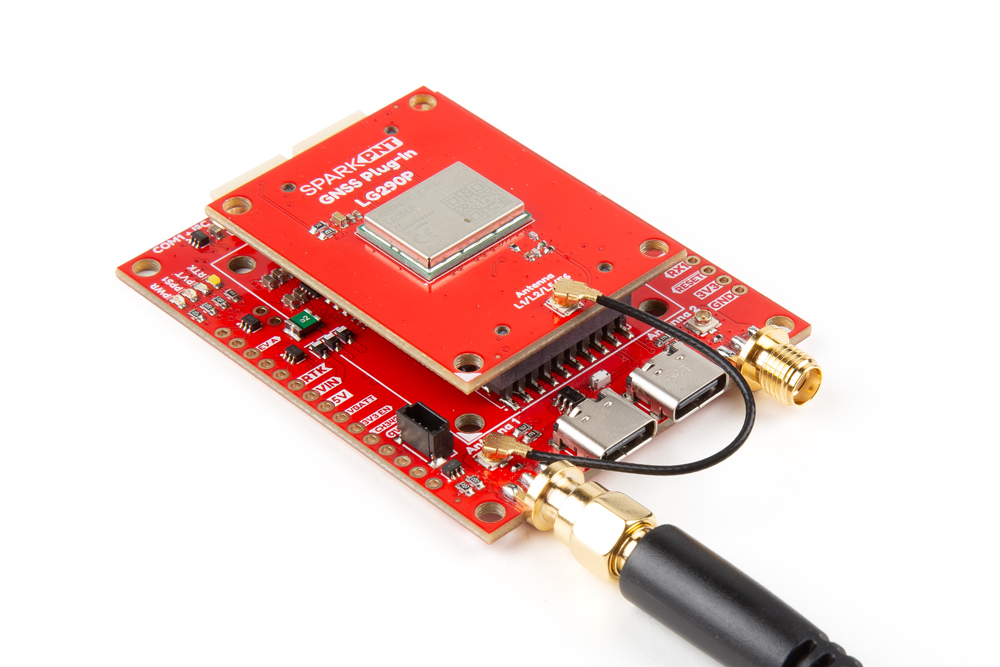

## External Antenna
In order to receive [GNSS](https://en.wikipedia.org/wiki/Satellite_navigation "Global Navigation Satellite System") signals, users will need a compatible antenna. For the best performance, we recommend an active L1/L2/L5/L6/L-band GNSS antenna for most of our GNSS Flex modules.

<figure markdown>
[{ width="400" }](./assets/img/hookup_guide/assembly-antenna.jpg "Click to enlarge")
<figcaption markdown>Connecting an antenna to the GNSS Flex Breakout board.</figcaption>
</figure>

!!! tip
	For the best performance, we recommend users choose a compatible L1/L2/L5/L6 GNSS antenna and utilize a low-loss cable. Also, don't forget that GNSS signals are fairly weak and can't penetrate buildings or dense vegetation. The GNSS antenna should have an unobstructed view of the sky.

	!!! note
		Please keep in mind that these are general suggestions for our GNSS Flex modules. Some of these boards may have multiple GNSS antenna connections, an integrated antenna, support specific frequency bands, etc. For more details on a specific GNSS Flex module, please refer to their [hookup guide](../modules.md).

!!! note "Direct Mounts"
	For users that want to attach a [helical](https://www.sparkfun.com/gnss-multi-band-l1-l2-l5-helical-antenna-sma.html) or similar GNSS antenna directly to the board, the antenna will block at least one of the USB-C connectors. Additionally, users should also consider the clearance to the USB-C connectors from the bottom of the antenna.

### Connection Options
There are two options for connecting an external antenna to a GNSS Flex module:

- An external antenna can be connected through the U.FL connector on the GNSS Flex board.
- However, for a sturdier connection, there is a signal pass-through between each pair of U.FL and SMA antenna connectors on the GNSS Flex Breakout board. To utilize the SMA connector, users can bridge the U.FL connections between the boards with a U.FL cable.

<figure markdown>
[{ width="400" }](./assets/img/hookup_guide/assembly-sma_adapter.jpg "Click to enlarge")
<figcaption markdown>Attaching an antenna directly to the GNSS Flex module with an adapter cable.</figcaption>
</figure>

<figure markdown>
[{ width="400" }](./assets/img/hookup_guide/assembly-ufl_bridge.jpg "Click to enlarge")
<figcaption markdown>Bridging the U.FL connectors on the boards, to utilize the SMA connector on the GNSS Flex Breakout board.</figcaption>
</figure>

### Signal Bridge
The signal bridges on the GNSS Flex Breakout can be utilized to connect an external antenna to the SMA connectors. For the connection to work, an U.FL cable needs to bridge the antenna connection from the GNSS Flex module to the GNSS Flex Breakout board. Due to the space constraint, we recommend connecting the U.FL cable to the GNSS Flex Breakout before attaching the GNSS Flex module to the breakout board.

<figure markdown>
[{ width="400" }](./assets/img/hookup_guide/assembly-ufl-1.jpg "Click to enlarge")
<figcaption markdown>Step 1 - Connect the U.FL cable to the GNSS Flex Breakout board.</figcaption>
</figure>

<figure markdown>
[{ width="400" }](./assets/img/hookup_guide/assembly-flex_module.jpg "Click to enlarge")
<figcaption markdown>Step 2 - Attach the GNSS Flex module to the breakout board.</figcaption>
</figure>

<figure markdown>
[{ width="400" }](./assets/img/hookup_guide/assembly-ufl-2.jpg "Click to enlarge")
<figcaption markdown>Step 3 - Connect the other end of the U.FL cable to the GNSS Flex module.</figcaption>
</figure>

<figure markdown>
[{ width="400" }](./assets/img/hookup_guide/assembly-ufl-3.jpg "Click to enlarge")
<figcaption markdown>A U.FL cable bridging the antenna connection between the boards.</figcaption>
</figure>

## Attach Module
The GNSS Flex system is a modular ecosystem designed around two 2x10-pin, 2mm pitch headers, so boards are pin-compatible for upgrades and easily swapped for repairs. Users simply, stack a SparkPNT GNSS Flex module onto the headers of its associated *carrier* board.

!!! tip "SMA Connector"
	When bridging the antenna connection to the SMA connector of the GNSS Flex Breakout, we recommend attaching the U.FL cable to the breakout board before the GNSS Flex module.

<figure markdown>
[{ width="400" }](./assets/img/hookup_guide/assembly-flex_module.jpg "Click to enlarge")
<figcaption markdown>Attaching a GNSS FLex module to the GNSS Flex Breakout board.</figcaption>
</figure>

### Board Alignment
The alignment indicator for mating these boards, is annotated with a triangle in the corner of the mating area.

<figure markdown>
[{ width="400" }](./assets/img/hookup_guide/assembly-animation.gif "Click to enlarge")
<figcaption markdown>The alignment and connection of a SparkPNT GNSS Flex module on top of a *carrier* board.</figcaption>
</figure>

## USB Connectors
The USB connections are primarily utilized to power and communicate with a SparkPNT GNSS Flex module. Users only need to connect the GNSS Flex breakout board to a computer using a USB-C cable.

### USB Interface
If the GNSS Flex module has the capability, a USB-C connector is provided on the GNSS Flex Breakout for the USB interface of the GNSS receiver.

<figure markdown>
[{ width="400" }](./assets/img/hookup_guide/assembly-usb.jpg "Click to enlarge")
<figcaption markdown>Connecting to the USB interface of the GNSS Flex module to a computer.</figcaption>
</figure>

### UART Interface
A USB-C connector is provided on the GNSS Flex Breakout for the `UART1` and `UART2` interfaces of the GNSS receiver.

<figure markdown>
[{ width="400" }](./assets/img/hookup_guide/assembly-uart.jpg "Click to enlarge")
<figcaption markdown>Connecting to the UART interfaces of the GNSS Flex module to a computer.</figcaption>
</figure>

!!! tip "USB Driver"
	Users may need to install the [USB driver](./software_overview.md#ch342-usb-driver) for the CH342 USB-to-serial converter chip.

## Breakout Pins
The [PTH](https://en.wikipedia.org/wiki/Through-hole_technology "Plated Through Holes") pins on the GNSS Flex breakout board are broken out into 0.1"-spaced pins on the outer edges of the board. For a more permanent connection, users can solder wires directly to the board. Otherwise, headers are a great option for their flexibility to develop with. When selecting headers, be sure you are aware of the functionality you require.

<figure markdown>
[{ width="400" }](./assets/img/hookup_guide/assembly-headers.jpg "Click to enlarge")
<figcaption markdown>Soldering headers to the GNSS Flex breakout board.</figcaption>
</figure>

!!! note "New to soldering?"
	If you have never soldered before or need a quick refresher, check out our [How to Solder: Through-Hole Soldering](https://learn.sparkfun.com/tutorials/how-to-solder-through-hole-soldering) guide.

	

	-   <a href="https://learn.sparkfun.com/tutorials/5">
		<figure markdown>
		
		</figure>

		---

		**How to Solder: Through-Hole Soldering**</a>

	

## JST Connectors
There are two locking JST connectors to easily access the UART and I^2^C interfaces of the GNSS Flex headers. Depending on the capabilities of the GNSS Flex module, the UART and I^2^C interfaces could be used to configure and communicate with the GNSS receiver. For example, the `COM1` JST connector can be used to attach a PixHawk flight controller.

<figure markdown>
[{ width="400" }](./assets/img/hookup_guide/assembly-jst_connector.jpg "Click to enlarge")
<figcaption markdown>Attaching a [telemetry radio](https://www.sparkfun.com/sik-telemetry-radio-v3-915mhz-100mw.html) to the `COM2` JST connector of the GNSS Flex Breakout board for RTK corrections.</figcaption>
</figure>

!!! tip "Output Voltage"
	In addition, each JST connector has a [`VOUT` jumper](./hardware_overview.md#jumpers) that users can modify to change the output voltage to 3.3V.

??? note "Never modified a jumper before?"
	Check out our <a href="https://learn.sparkfun.com/tutorials/664">Jumper Pads and PCB Traces tutorial</a> for a quick introduction!

	<article class="grid cards" style="text-align: center;" markdown>

	-   <a href="https://learn.sparkfun.com/tutorials/664">
		<figure markdown>
		
		</figure>

		---

		**How to Work with Jumper Pads and PCB Traces**</a>

	</article>

When connecting the GNSS Flex Breakout board to another device, users need to be aware of the pin connections and voltage ranges of the products. Below, are tables of the pin connections for each JST connector that users can reference.

<article style="text-align: center;" markdown>

<table border="1" markdown>
<tr markdown>
<th align="center" colspan="7" markdown>**<code>COM1 + I^2^C</code>**
</th>
</tr>
<tr markdown>
<th style="vertical-align:middle;">Pin Number</th>
<td align="center" markdown>
	**1** 
	*(Left Side)*
</td>
<td align="center" markdown>**2**</td>
<td align="center" markdown>**3**</td>
<td align="center" markdown>**4**</td>
<td align="center" markdown>**5**</td>
<td align="center" markdown>
	**6** 
	*(Right)*
</td>
</tr>
<tr markdown>
<th style="vertical-align:middle;">Label</th>
<td align="center" markdown>`5V`</td>
<td align="center" markdown>`TXD1`</td>
<td align="center" markdown>`RXD1`</td>
<td align="center" markdown>`SCL`</td>
<td align="center" markdown>`SDA`</td>
<td align="center" markdown>`GND`</td>
</tr>
<tr markdown>
<th style="vertical-align:middle;">Function</th>
<td align="center" markdown>Power: **5V**</td>
<td align="center" markdown>UART - Transmit</td>
<td align="center" markdown>UART - Receive</td>
<td align="center" markdown>I^2^C - Clock</td>
<td align="center" markdown>I^2^C - Data</td>
<td align="center" markdown>Ground</td>
</tr>
</table>

</article>

<article style="text-align: center;" markdown>

<table border="1" markdown>
<tr markdown>
<th align="center" colspan="7" markdown>**`COM2`**
</th>
</tr>
<tr markdown>
<th style="vertical-align:middle;">Pin Number</th>
<td align="center" markdown>
	**1** 
	*(Left Side)*
</td>
<td align="center" markdown>**2**</td>
<td align="center" markdown>**3**</td>
<td align="center" markdown>**4**</td>
<td align="center" markdown>**5**</td>
<td align="center" markdown>
	**6** 
	*(Right)*
</td>
</tr>
<tr markdown>
<th style="vertical-align:middle;">Label</th>
<td align="center" markdown>`5V`</td>
<td align="center" markdown>`TXD2`</td>
<td align="center" markdown>`RXD2`</td>
<td align="center" markdown>`CTS2`</td>
<td align="center" markdown>`RTS2`</td>
<td align="center" markdown>`GND`</td>
</tr>
<tr markdown>
<th style="vertical-align:middle;">Function</th>
<td align="center" markdown>Power: **5V**</td>
<td align="center" markdown>Transmit</td>
<td align="center" markdown>Receive</td>
<td align="center" markdown>Clear-to-Send</td>
<td align="center" markdown>Ready-to-Send</td>
<td align="center" markdown>Ground</td>
</tr>
</table>

</article>

## SD Card Slot
If the GNSS Flex module has the capability, an SD card slot is provided on the GNSS Flex Breakout for data logging.

<figure markdown>
[{ width="400" }](./assets/img/hookup_guide/assembly-sd_card.jpg "Click to enlarge")
<figcaption markdown>Inserting an &micro;SD card to the SD card slot on the GNSS Flex Breakout board.</figcaption>
</figure>

## Qwiic Devices
The Qwiic system allows users to effortlessly prototype with a Qwiic compatible I^2^C device without soldering. Users can attach GNSS Flex breakout board along with other Qwiic [sensors or boards](https://www.sparkfun.com/special-categories/qwiic.html?sf_qwiic_product_type=8273%2C8279%2C8285%2C8288%2C8291%2C8294) to any [Qwiic compatible microcontroller](https://www.sparkfun.com/development-boards/microcontrollers.html?sf_global_qwiic_connector=8262), with just a few [Qwiic cables](https://www.sparkfun.com/sparkfun-qwiic-cable-kit.html). *(The example below, is for demonstration purposes and is not pertinent to the board functionality or this tutorial.)*

<figure markdown>
[{ width="400" }](./assets/img/hookup_guide/assembly-qwiic.jpg "Click to enlarge")
<figcaption markdown>Several Qwiic devices and microcontroller connected to the GNSS Flex breakout board.</figcaption>
</figure>
