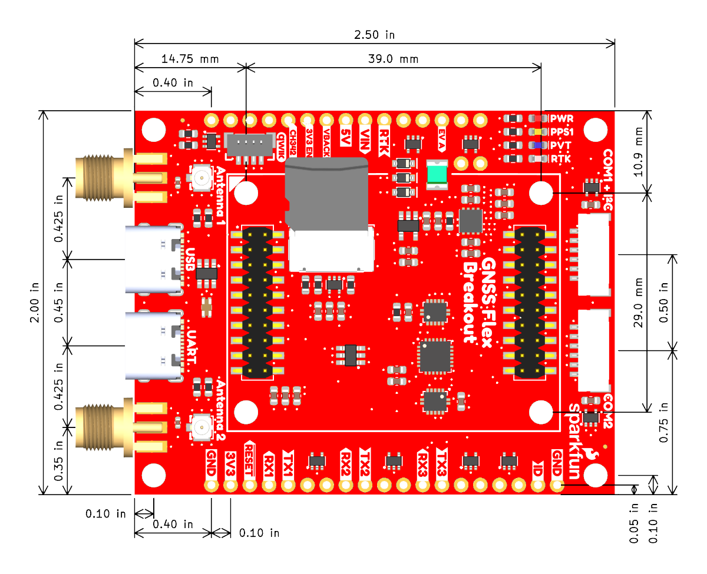

<article style="text-align: center;" markdown>
{ width="650px" }
</article>

## Introduction

-   <a href="https://www.sparkfun.com/sparkfun-gnss-flex-breakout.html">
	**SparkFun GNSS Flex Breakout** 
	**SKU:** GPS-28137

	---

	<figure markdown>
	
	</figure></a>

	<article style="text-align: center;" markdown>
	{ .tinyqr }
	[Purchase from SparkFun :fontawesome-solid-cart-plus:{ .heart }](https://www.sparkfun.com/sparkfun-gnss-flex-breakout.html){ .md-button .md-button--primary }
	</article>

-	The SparkFun GNSS Flex Breakout board is a [*carrier board*](../carriers.md) for our [SparkPNT GNSS Flex modules](../modules.md). With pre-soldered headers, the GNSS Flex Breakout board provides access to all of the interfaces from a GNSS Flex module. We have also included two 6-pin JST connectors, same as the ones used on Pixhawk flight controllers. The JST connectors allow you to: connect the GNSS to a Pixhawk; or connect a radio to transfer RTCM correction data. Power can be provided by any or all of: the USB connectors or the `VIN` breakout pin.

	The GNSS Flex Breakout comes populated with two sets of 2x10 pin, 2mm pitch male headers for attaching a GNSS Flex module. With these headers, the GNSS Flex system is designed to be modular so that boards are pin-compatible for upgrades and can be easily swapped for repairs. Depending on the capabilities of the GNSS Flex module that is connected, these pins will breakout the USB, UART (x4), I^2^C, and SD card interfaces for the GNSS receiver along with any PPS (x2) or event (x2) signals, using a standardized pin out. There board also has four LEDs indicators for power and the `PPS1`, `PVT`, and `RTK` signals from the GNSS Flex module.

	!!! note
		By default, the CH342 USB-to-Serial converter chip is connected to both the GNSS `UART1` and `UART2` interfaces. When you connect the `UART` USB port to your computer and install the driver, those two UART interfaces will appear as COM ports. If you need dedicated access to the `UART1` or `UART2` breakout pins, or want to use either of the JST connectors, you will need to disable the CH342. On this board, we have made this simple; just pull the `CH342 EN` breakout pin `LOW` or connect it to `GND`. Otherwise, there is also a `CH342 EN` jumper you can solder instead.

		By default, Pin 1 of the JST connectors provides 5V output. But jumpers on the board allow the voltage to be changed to 3.3V. Or you can isolate the other power sources and connect an external 5V power input on Pin 1 instead. It is up to you.
	

## Design Files

<!-- Import the component -->

-   :kicad-primary:{ .enlarge-logo } **Design Files**

	---

	- :fontawesome-solid-file-pdf: [Schematic](./assets/board_files/schematic.pdf)
	- :material-folder-zip: [KiCad Files](./assets/board_files/kicad_files.zip)
	- :material-rotate-3d: [STEP File](./assets/3d_model/cad_model.step)
	- :fontawesome-solid-file-pdf: [Board Dimensions](./assets/board_files/dimensions.pdf):

-   <!-- Boxes in tabs -->

	=== "3D Model"
		<article style="text-align: center;" markdown>
		<model-viewer src="../assets/3d_model/web_model.glb" camera-controls poster="../assets/3d_model/poster.png" tone-mapping="neutral" shadow-intensity="2" shadow-softness="0.2" camera-orbit="0deg 75deg 0.1623m" field-of-view="25.11deg" style="width: 100%; height: 450px;">
		</model-viewer>
		</article>

		???+ tip "Manipulate 3D Model"
			<article style="text-align: center;" markdown>

			| Controls       | Mouse                    | Touchscreen    |
			| :------------- | :----------------------: | :------------: |
			| Zoom           | Scroll Wheel             | 2-Finger Pinch |
			| Rotate         | ++"Left-Click"++ & Drag  | 1-Finger Drag  |
			| Move/Translate | ++"Right-Click"++ & Drag | 2-Finger Drag  |

			</article>

	=== "Dimensions"
		<article style="text-align: center;" markdown>
		[{ width="400" }](./assets/board_files/dimensions.png "Click to enlarge")
		<figcaption markdown>Dimensions of the GNSS Flex Breakout board.</figcaption>
		</article>

		???+ tip "Need more measurements?"
			For more information about the board's dimensions, users can download the [KiCad files](./assets/board_files/kicad_files.zip) for this board. These files can be opened in KiCad and additional measurements can be made with the measuring tool.

			!!! info ":octicons-download-16:{ .heart } KiCad - Free Download!"
				KiCad is free, open-source [CAD]("computer-aided design") program for electronics. Click on the button below to download their software. *(\*Users can find out more information about KiCad from their [website](https://www.kicad.org/).)*

				<article style="text-align: center;" markdown>
				[Download :kicad-primary:{ .enlarge-logo }](https://www.kicad.org/download/ "Go to downloads page"){ .md-button .md-button--primary }
				</article>

			???+ info ":straight_ruler: Measuring Tool"
				This video demonstrates how to utilize the dimensions tool in KiCad, to include additional measurements:

				<article class="video-500px" style="text-align: center; margin: auto;" markdown>
				<iframe src="https://www.youtube.com/embed/-eXuD8pkCYw" title="KiCad Dimension Tool" frameborder="0" allow="accelerometer; autoplay; clipboard-write; encrypted-media; gyroscope; picture-in-picture" allowfullscreen></iframe>
				{ .qr width="85px" }
				</article>

## Board Layout
The GNSS Flex system is designed around two 2x10-pin, 2mm pitch headers used mate the two types of boards. A standardized pin layout, keeps the ecosystem pin-compatible for upgrades and allows board to be easily swapped for repairs. Depending on the capabilities of the GNSS receiver, these pins will breakout the USB, UART (x4), I^2^C, and SD card interfaces along with any PPS or event signals of the GNSS receiver.

<figure markdown>
[{ width="650px" }](./assets/img/hookup_guide/layout.png "Click to enlarge")
<figcaption markdown>Layout of the major components of the GNSS Flex Breakout board.</figcaption>
</figure>

The GNSS Flex Breakout has the following features:

1. **GNSS Flex Headers**
:   Two sets of 2x10 pin, 2mm pitch female headers for connecting a GNSS Flex module.
1. **Alignment Indicator**
:   Used to indicate the board alignment of a GNSS Flex module.
1. **Signal Bridges**
:   Two U.FL-to-SMA signal bridges, provide on-board adapters for connecting an external GNSS antenna(s) or another input/output signal(s).
1. **Status LEDs**
:   Four status indication LEDs for the attached GNSS Flex module.
1. **USB-C Connectors**
:   Used to access the USB and `UART1`/`UART2` interfaces of a GNSS Flex Module.
1. **JST Connectors**
:   Breaks out the `UART1`, `UART2`, and  I^2^C, and interfaces of a GNSS Flex Module to connect a PixHawk controller or [telemetry radio](https://www.sparkfun.com/sik-telemetry-radio-v3-915mhz-100mw.html).
1. **SD Card Slot**
:   Depending on the capabilities of the GNSS Flex module, a &micro;SD card slot is available for data logging.
1. **Qwiic Connector**
:   Depending on the capabilities of the GNSS Flex module, a Qwiic connector is available for connecting to a controller.

## USB Connectors
Depending on the capabilities of the GNSS receiver, the USB connectors will break out the USB interface and/or UART interfaces from the GNSS Flex module.

<figure markdown>
[{ width="400" }](./assets/img/hookup_guide/usb.png "Click to enlarge")
<figcaption markdown>The USB connectors on the GNSS Flex Breakout board.</figcaption>
</figure>

- `USB` USB-C connector
	- If available, connects directly w/ GNSS Flex Module's USB interface
	- 5V power input
- `UART` USB-C connector
	- Interfaces to `UART1` and `UART2` on the GNSS Flex Module via a CH342 USB-to-Serial converter
	- 5V power input

	!!! info
		To utilize the [PTH](https://en.wikipedia.org/wiki/Through-hole_technology "Plated Through Holes") pins or JST connections of the `UART1` and `UART2` interfaces, the CH342 USB-to-Serial converter must be disabled with either the [`CH342 EN` jumper](#jumpers) or the `CH342 EN` PTH pin.

## SMA Connectors
The SMA connectors, provide users with a more robust connection for interfacing with signals to/from the GNSS Flex module. Each pair of U.FL and SMA connectors are bridged together and their ground plane isolated from the rest of the board, this allows users to pass signals between the GNSS Flex module and the GNSS Flex Breakout board. On the GNSS Flex Breakout board, we provide two sets of signal bridges. These signal bridges will primarily be used to attach an external GNSS antenna for their GNSS Flex module.

<figure markdown>
[{ width="400" }](./assets/img/hookup_guide/sma_connectors.png "Click to enlarge")
<figcaption markdown>The RF signal bridges on the GNSS Flex Breakout, which provides a more robust SMA connection.</figcaption>
</figure>

## Breakout Pins
The primary function of the SparkFun GNSS Flex Breakout board is to expose the interfaces of the GNSS Flex modules. Most of which, are provided through the [PTH](https://en.wikipedia.org/wiki/Through-hole_technology "Plated Through Holes") pins.

<figure markdown>
[{ width="400" }](./assets/img/hookup_guide/flex_header-pinout.png "Click to enlarge")
<figcaption markdown>The breakout pins on the board connected to the Flex header system.</figcaption>
</figure>

Breakout Pins and Exposed Interfaces:

- Power Pins
	- VIN
	- 5V
	- 3.3V
	- 3.3V Enable
	- Backup power
	- Reset
- USB data
- UART (x4)
- SD card *(see [SD Card Slot](#sd-card-slot))*
- I^2^C bus
- PPS signals (x2)
- Status indicators (x2)
- Event triggers (x2)
- ID pin

### Power
The simplest method to power the GNSS Flex breakout board is through the USB-C connectors. However, only **3.3V** is required to power an attached GNSS Flex module; the 5V is only utilized for the USB interface and to power the JST connectors.

<figure markdown>
[{ width="400" }](./assets/img/hookup_guide/power_connections.png "Click to enlarge")
<figcaption markdown>The GNSS Flex breakout board's power connections.</figcaption>
</figure>

Below, is a general summary of the power circuitry on the board; most are broken out as [PTH](https://en.wikipedia.org/wiki/Through-hole_technology "Plated Through Holes") pins:

<article class="annotate" markdown>

- Power Supplies - Power sources for the entire board
	- **`VIN`** - The general input voltage
	- **`5V`** - The voltage from the USB-C connector, usually **5V**.
		- Input Voltage Range: 2.2 - 5.5V (1)
		- Powers the 3.3V voltage regulators
			- [AP7361C](./assets/component_documentation/AP7361C.pdf), which can source up to 1.5A
			- [RT9080](./assets/component_documentation/RT9080.pdf), which can source up to 600mA
		- They also power the [JST connectors](#jst-connectors)
- **`3V3`** - Provides a regulated 3.3V from the [AP7361C](./assets/component_documentation/AP7361C.pdf), using the power supplied from the `VIN`, `5V`, and/or USB-C connectors
	- Used to power the GNSSS Flex module, LEDs, and [Qwiic connectors](#qwiic-connector)
	- Controlled by the `3V3 EN` pin, which is enabled by default
- **`3V3 EN`** - Enables the voltage output from the [AP7361C](./assets/component_documentation/AP7361C.pdf), 3.3V voltage regulator
	- Enabled by default *(active `HIGH`)*
- **`VBACKUP`** - Provides a regulated 3.3V from the [RT9080](./assets/component_documentation/RT9080.pdf), using the power supplied from the `VIN`, `5V`, and/or USB-C connectors
	- Provides backup power to the GNSS Flex module to maintain ephemeris data for warm starts
- **`RESET`** - Used to reset the GNSS Flex module
- **`GND`** - The common ground or the 0V reference for the voltage supplies.

</article>

1. The [RT9080](./assets/component_documentation/RT9080.pdf) LDO regulator has an input voltage range of 1.2 - 5.5V and the [AP7361C](./assets/component_documentation/AP7361C.pdf) LDO regulator has an input voltage range of 2.2 - 6.0V. A minimum supply voltage of **3.5V** is recommended for a 3.3V output.

!!! warning "Backup Battery"
	When connecting an external battery or power source to the `VBACKUP` pin, users should disconnect the [`VBACKUP` jumper](#jumpers).

!!! tip "JST Connector"
	The `VOUT` pins for the [JST connectors](#jst-connectors) are designed to operate as a voltage output. However, an input voltage can be supplied through the pin, but users should be mindful of any voltage contention issues.

	Additionally, the [jumper for the `VOUT` pin](#jumpers) can be modified to change to output voltage level.

!!! info
	For more details, users can reference the [schematic](./assets/board_files/schematic.pdf) and the datasheets of the individual components on the board.

### Interfaces
The following interfaces and signals of the GNSS Flex system are connected to the 40-pin female GPIO header of the GNSS Flex Breakout board. Below, are tables detailing the pin connections for each interface.

=== "USB"
	If available, the `USB` interface of the GNSS Flex module can be accessed through the `USB` USB-C connector.

	<figure markdown>
	[{ width="400" }](./assets/img/hookup_guide/usb-usb.png "Click to enlarge")
	<figcaption markdown>The USB interface from the GNSS Flex system on the GNSS Flex breakout board.</figcaption>
	</figure>

=== "UART"

	!!! tip "UART Numbering"
		Please note that the UART numbers (`UART1` - `UART4`) listed below follows the GNSS Flex Module UART numbering scheme.

	

	

	<figure markdown>
	[{ width="400" }](./assets/img/hookup_guide/uart.png "Click to enlarge")
	<figcaption markdown>The pin connections of the UART interfaces, from the GNSS Flex system on the GNSS Flex breakout board.</figcaption>
	</figure>

	

	

	`UART1`
	:   The `UART1` interface can be accessed through either the `UART` USB-C connector, <code>COM1 + I^2^C</code> JST connector, or `RX1`/`TX1`/`CTS1`/`RTS1` set of [PTH](https://en.wikipedia.org/wiki/Through-hole_technology "Plated Through Holes") pins. However, in order to utilize the <code>COM1 + I^2^C</code> JST connector or `RX1`/`TX1`/`CTS1`/`RTS1` PTH pins, the CH342 must be disabled using either the [`CH342 EN` jumper](#jumpers) or the `CH342 EN` PTH pin.

	`UART2`
	:   The `UART2` interface can be accessed through either the `UART` USB-C connector, `COM2` JST connector, or `RX2`/`TX2`/`CTS2`/`RTS2` set of [PTH](https://en.wikipedia.org/wiki/Through-hole_technology "Plated Through Holes") pins. However, in order to utilize the `COM2` JST connector or `RX2`/`TX2`/`CTS2`/`RTS2` PTH pins, the CH342 must be disabled using either the [`CH342 EN` jumper](#jumpers) or the `CH342 EN` PTH pin.

	`UART3`
	:   The `UART3` interface can be accessed through the `RX3`/`TX3`/`CTS3`/`RTS3` set of [PTH](https://en.wikipedia.org/wiki/Through-hole_technology "Plated Through Holes") pins.

	`UART4`
	:   The `UART4` interface can be accessed through the `RX4`/`TX4` [PTH](https://en.wikipedia.org/wiki/Through-hole_technology "Plated Through Holes") pins.

	

	

=== "I^2^C"
	The I^2^C interface can be accessed through either the Qwiic connector, <code>COM1 + I^2^C</code> JST connector, or `SCL`/`SDA` [PTH](https://en.wikipedia.org/wiki/Through-hole_technology "Plated Through Holes") pins. Depending on how the I^2^C bus is configured, users may need to use pull-up resistors, which can be enabled with the [`I^2^C` jumper](#jumpers).

	<figure markdown>
	[{ width="400" }](./assets/img/hookup_guide/i2c.png "Click to enlarge")
	<figcaption markdown>The pin connections of the I^2^C interface, from the GNSS Flex system on the GNSS Flex breakout board.</figcaption>
	</figure>

=== "PPS Signals"
	The two [`PPS`](https://en.wikipedia.org/wiki/Pulse-per-second_signal "Pulse Per Second") signals can be accessed through the `PPS1` and `PPS2` [PTH](https://en.wikipedia.org/wiki/Through-hole_technology "Plated Through Holes") pins. The `PPS1` pin is also connected to the [`PPS` LED](#leds), which can be disabled with a [jumper](#jumpers) for low power applications.

	<figure markdown>
	[{ width="400" }](./assets/img/hookup_guide/pps.png "Click to enlarge")
	<figcaption markdown>The pin connections of the PPS signals, from the GNSS Flex system on the GNSS Flex breakout board.</figcaption>
	</figure>

=== "Event Triggers"
	The two event triggers can be accessed through the `EVENTA` and `EVENTB` [PTH](https://en.wikipedia.org/wiki/Through-hole_technology "Plated Through Holes") pins.

	<figure markdown>
	[{ width="400" }](./assets/img/hookup_guide/event.png "Click to enlarge")
	<figcaption markdown>The pin connections of the event triggers, from the GNSS Flex system on the GNSS Flex breakout board.</figcaption>
	</figure>

=== "Status Indicators"
	There are two status indicators, which can be accessed through the `PVT` and `RTK` [PTH](https://en.wikipedia.org/wiki/Through-hole_technology "Plated Through Holes") pins. These pins are also connected to the [`PVT` and `RTK` LEDs](#leds), which can be disabled with their [respective jumpers](#jumpers) for low power applications.

	<figure markdown>
	[{ width="400" }](./assets/img/hookup_guide/status.png "Click to enlarge")
	<figcaption markdown>The pin connections of the status indicators, from the GNSS Flex system on the GNSS Flex breakout board.</figcaption>
	</figure>

=== "ID Pin"
	The `ID` pin can be utilized to identify the GNSS receiver of a connected GNSS Flex module.

	

	

	<figure markdown>
	[{ width="400" }](./assets/img/hookup_guide/id.png "Click to enlarge")
	<figcaption markdown>The `ID` pin from the GNSS Flex system, used to identify a connected GNSS Flex module.</figcaption>
	</figure>

	

	

	<article style="text-align: center;" markdown>

	| GNSS Flex Module | ID Resistors            | ID Value |
	| :--------------: | :---------------------: | :------: |
	| mosaic-X5        | 1.0k&ohm; + 47.0k&ohm;  | 0.06875V |
	| LG290P           | 3.3k&ohm; + 10.0k&ohm;  | 0.81880V |
	| DAN-F10          | 5.62k&ohm; + 6.8k&ohm;  | 1.49324V |
	| ZED-X20P         | 15.0k&ohm; + 12.1k&ohm; | 1.82657V |

	</article>

	

	

## LEDs
There are four status LEDs on the GNSS Flex Breakout:

<figure markdown>
[{ width="400" }](./assets/img/hookup_guide/LEDs.png "Click to enlarge")
<figcaption markdown>The status LED indicators on the GNSS Flex Breakout board.</figcaption>
</figure>

- `PWR` - Power *(Red)*
	- Turns on once power is supplied to the board
- `PPS` - Pulse-Per-Second *(Yellow)*
	- Indicates when there is a pulse-per-second signal from the GNSS Flex module
- `RTK` - RTK *(White)*
	- Usually indicates when an RTK fix has been established or when the correct RTCM data is being received by the GNSS Flex module
- `PVT` - PVT *(Blue)*
	- Usually indicates when an GNSS lock or a position fix has been established by the GNSS Flex module

!!! info
	For low power applications, the LEDs can be disabled to conserve energy. *See the [**Jumpers** section](#jumpers).*

## JST Connectors
There are two locking JST-GH connectors to easily access the UART and I^2^C interfaces of the GNSS Flex headers. Depending on the capabilities of the GNSS Flex module, the UART and I^2^C interfaces could be used to configure and communicate with the GNSS receiver.

<figure markdown>
[{ width="400" }](./assets/img/hookup_guide/jst_connectors.png "Click to enlarge")
<figcaption markdown>The JST connectors on the GNSS Flex Breakout board.</figcaption>
</figure>

- <code>COM1 + I^2^C</code>
	- Breaks out the `UART1` and I^2^C interfaces for a connection to a Pixhawk flight controller
	- 5V power output
- `COM2`
	- Breaks out the `UART2` interface *(w/ flow control)* for connection to a [telemetry radio](./hardware_assembly.md#jst-connectors)
	- 5V power output

!!! danger "Power Options"
	By default, the locking JST connectors provide a 5V power output. However, an optional 3.3V power output can be configured by modifying the [jumpers](#jumpers) underneath the connectors, on the opposite side of the board.

	These connector can also function as an optional 5V power input, when all other power sources have been disconnected from the GNSS Flex Breakout board.

???+ info "Pin Connections"
	Below, are tables of the pin connections of each JST connector:

	

	<article style="text-align: center;" markdown>

	<table border="1" markdown>
	<tr markdown>
	<th align="center" colspan="7" markdown>**<code>COM1 + I^2^C</code>**
	</th>
	</tr>
	<tr markdown>
	<th style="vertical-align:middle;">Pin Number</th>
	<td align="center" markdown>
		**1** 
		*(Left Side)*
	</td>
	<td align="center" markdown>**2**</td>
	<td align="center" markdown>**3**</td>
	<td align="center" markdown>**4**</td>
	<td align="center" markdown>**5**</td>
	<td align="center" markdown>
		**6** 
		*(Right)*
	</td>
	</tr>
	<tr markdown>
	<th style="vertical-align:middle;">Label</th>
	<td align="center" markdown>`5V`</td>
	<td align="center" markdown>`TXD1`</td>
	<td align="center" markdown>`RXD1`</td>
	<td align="center" markdown>`SCL`</td>
	<td align="center" markdown>`SDA`</td>
	<td align="center" markdown>`GND`</td>
	</tr>
	<tr markdown>
	<th style="vertical-align:middle;">Function</th>
	<td align="center" markdown>Power: **5V**</td>
	<td align="center" markdown>UART - Transmit</td>
	<td align="center" markdown>UART - Receive</td>
	<td align="center" markdown>I^2^C - Clock</td>
	<td align="center" markdown>I^2^C - Data</td>
	<td align="center" markdown>Ground</td>
	</tr>
	</table>

	</article>

	<article style="text-align: center;" markdown>

	<table border="1" markdown>
	<tr markdown>
	<th align="center" colspan="7" markdown>**`COM2`**
	</th>
	</tr>
	<tr markdown>
	<th style="vertical-align:middle;">Pin Number</th>
	<td align="center" markdown>
		**1** 
		*(Left Side)*
	</td>
	<td align="center" markdown>**2**</td>
	<td align="center" markdown>**3**</td>
	<td align="center" markdown>**4**</td>
	<td align="center" markdown>**5**</td>
	<td align="center" markdown>
		**6** 
		*(Right)*
	</td>
	</tr>
	<tr markdown>
	<th style="vertical-align:middle;">Label</th>
	<td align="center" markdown>`5V`</td>
	<td align="center" markdown>`TXD2`</td>
	<td align="center" markdown>`RXD2`</td>
	<td align="center" markdown>`CTS2`</td>
	<td align="center" markdown>`RTS2`</td>
	<td align="center" markdown>`GND`</td>
	</tr>
	<tr markdown>
	<th style="vertical-align:middle;">Function</th>
	<td align="center" markdown>Power: **5V**</td>
	<td align="center" markdown>Transmit</td>
	<td align="center" markdown>Receive</td>
	<td align="center" markdown>Clear-to-Send</td>
	<td align="center" markdown>Ready-to-Send</td>
	<td align="center" markdown>Ground</td>
	</tr>
	</table>

	</article>

	

## SD Card Slot
Depending on the capabilities of the GNSS receiver, the &micro;SD card slot can be used for data logging.

<figure markdown>
[{ width="400" }](./assets/img/hookup_guide/sd_card.png "Click to enlarge")
<figcaption markdown>The SD card slot on the GNSS Flex Breakout board.</figcaption>
</figure>

## Qwiic Connector
The Qwiic connector is attached to the I^2^C interface of the GNSS Flex headers. Depending on the capabilities of the GNSS Flex module, the I^2^C interface could be used to configure and communicate with the GNSS receiver.

<figure markdown>
[{ width="400" }](./assets/img/hookup_guide/qwiic.png "Click to enlarge")
<figcaption markdown>The Qwiic connector on the GNSS Flex Breakout board.</figcaption>
</figure>

??? tip "What is Qwiic?"

	

	

	<!-- Qwiic Banner -->
	<article style="text-align: center;" markdown>
	[{ width=400 }](https://www.sparkfun.com/qwiic)
	[{ width=400 }](https://www.sparkfun.com/qwiic)
	</article>

	---

	The [Qwiic connect system](https://www.sparkfun.com/qwiic) is a solderless, polarized connection system that allows users to seamlessly daisy chain I^2^C boards together. Play the video, to learn more about the Qwiic connect system or click on the banner above to learn more about [Qwiic products](https://www.sparkfun.com/qwiic).

	

	

	<article class="video-500px" style="text-align: center; margin: auto;" markdown>
	<iframe src="https://www.youtube.com/embed/x0RDEHqFIF8" title="SparkFun's Qwiic Connect System" frameborder="0" allow="accelerometer; encrypted-media; gyroscope; picture-in-picture" allowfullscreen></iframe>
	{ .qr width=100 }
	</article>

	

	

	!!! info "Features of the Qwiic System"

		=== "No Soldering"

			{ align="left" width="90" }
			{ align="left" width="90" }

			Qwiic cables (4-pin JST) plug easily from development boards to sensors, shields, accessory boards and more, making easy work of setting up a new prototype.

		=== "Polarized Connector"

			{ align="left" width="90" }
			{ align="left" width="90" }

			There's no need to worry about accidentally swapping the `SDA` and `SCL` wires on your breadboard. The Qwiic connector is polarized so you know you’ll have it wired correctly every time.

			The part numbers for the PCB connector is `SM04B-SRSS` ([Datasheet](https://cdn.sparkfun.com/assets/parts/1/2/2/8/9/Qwiic_Connector_Datasheet.pdf)) and the mating connector on the cables is `SHR04V-S-B`; or an equivalent *1mm pitch, 4-pin JST connection*.

		=== "Daisy Chain-able"

			{ align="left" width="90" }
			{ align="left" width="90" }

			It’s time to leverage the power of the I^2^C bus! Most Qwiic boards will have two or more connectors on them, allowing multiple devices to be connected.

## Jumpers
There are twelve jumpers on the GNSS Flex Breakout:

??? note "Never modified a jumper before?"
	Check out our <a href="https://learn.sparkfun.com/tutorials/664">Jumper Pads and PCB Traces tutorial</a> for a quick introduction!

	

	-   <a href="https://learn.sparkfun.com/tutorials/664">
		<figure markdown>
		
		</figure>

		---

		**How to Work with Jumper Pads and PCB Traces**</a>

	

<figure markdown>
[{ width="400" }](./assets/img/hookup_guide/jumpers.png "Click to enlarge")
<figcaption markdown>Jumpers on the bottom of the GNSS Flex Breakout board.</figcaption>
</figure>

The jumpers for the [status LEDs](#leds), can be cut to disable the associated LED.

- `PWR` - Power *(Red)*
- `PPS` - Pulse-Per-Second *(Yellow)*
- `RTK` - RTK *(White)*
- `PVT` - PVT *(Blue)*

`SHLD`
:   These jumpers can be cut to isolate the shielding of the associated [USB-C connector](#usb-connectors) from the ground plane of the board.

`VOUT`
:   These jumpers can be modified to configure the I/O voltage of the [JST connectors](#jst-connectors) between 3.3V or 5V.

`I2C`
:   This jumper, next to the [Qwiic connector](#qwiic-connector), can be bridged to attach 2.2k&ohm; pull-up resistors to the I^2^C bus.

`VBACKUP`
:   This jumper can be disconnected to allow for an external battery to be connected `VBACKUP` [PTH](https://en.wikipedia.org/wiki/Through-hole_technology "Plated Through Holes") pin.

`CH342 EN`
:   This jumper can be shorted, to disable the CH342 USB-to serial converter. This allows the UART interfaces to be accessed from the [PTH](https://en.wikipedia.org/wiki/Through-hole_technology "Plated Through Holes") or JST connections, instead of their USB connection.

`MEAS`
: This jumper can be utilized to measure the current coming into the `5V` power rail from either of the USB and/or `VIN` power sources.

