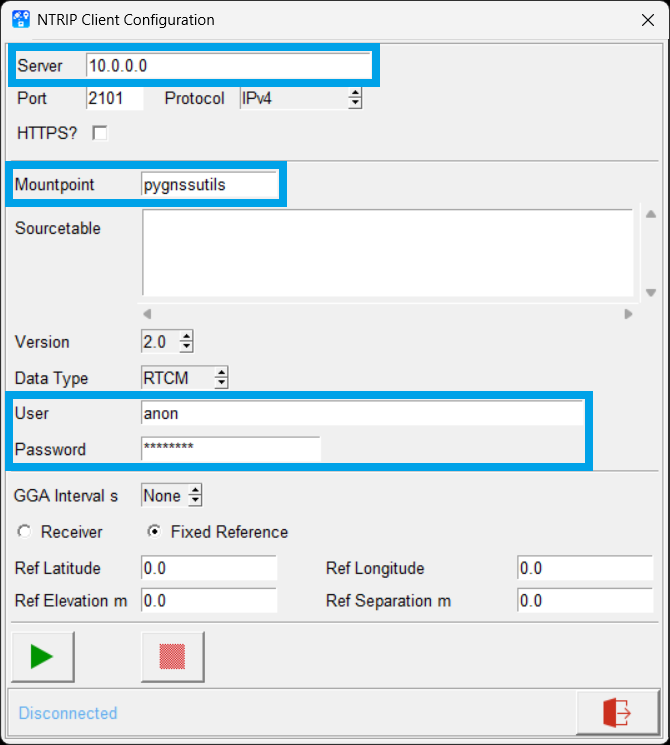
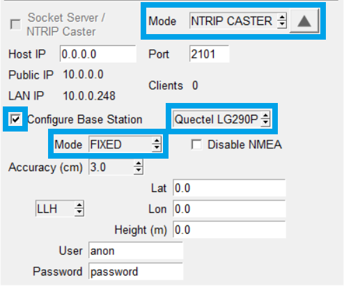
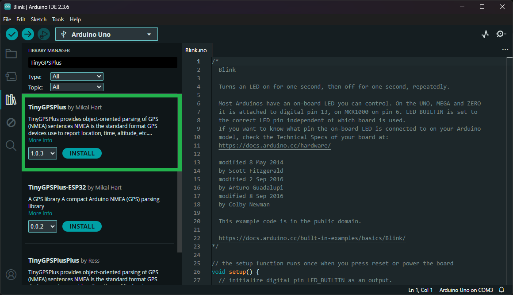

## USB Drivers
Depending on the GNSS Flex module that is attached, users may need to install specific USB driver. However, to access the UART interfaces through the `UART` USB-C connector, users will need to install the [CH342 USB driver](#ch342-usb-driver) below.


### CH342 USB Driver
The USB drivers for the CH342 USB-to-Serial converter can be downloaded from the [manufacturer's website](https://www.wch-ic.com/search?q=CH342&t=downloads).


<div class="grid cards" align="center" markdown>

-   :material-microsoft-windows: **Windows**

	---

	[:octicons-download-16:{ .heart } Download Page for `CH343SER.EXE`](https://www.wch-ic.com/downloads/CH343SER_EXE.html){ .md-button .md-button--primary target="blank" }


-   :material-apple: **MacOS**

	---

	[:octicons-download-16:{ .heart } Download Page for `CH341SER_MAC.ZIP`](https://www.wch-ic.com/downloads/CH34XSER_MAC_ZIP.html){ .md-button .md-button--primary target="blank" }

</div>


!!! info "Linux"
	A USB driver is not required for Linux based operating systems.


### GNSS Receiver
Some GNSS receivers may require a USB driver to be installed, before users can connect to its USB interface. For example, the ZED-X20P GNSS receiver does not require a USB drive to be installed to access its USB interface for development purposes; meanwhile, the mosaic-X5 GNSS receiver does require a USB driver to be installed before it can be connected to a Windows OS computer.


!!! info
	For more details on a specific GNSS Flex module, please refer to their [hookup guide](../modules.md).


<!-- Add snippet for the manufacturer's software and PyGPSClient -->
<!-- ========================================================================================================== -->

--8<-- "./software_overview.md:7:"

<!--  -->


### Installation
There are a variety of [installation methods](https://github.com/semuconsulting/PyGPSClient?tab=readme-ov-file#installation) detailed in the GitHub repository's `README.md` file. However, we recommend utilizing either the [`pip` installation method](https://github.com/semuconsulting/PyGPSClient?tab=readme-ov-file#install-using-pip). Depending on how Python is installed on the computer, one of the following commands should allow users to install the software:

```shell
python3 -m pip install pygpsclient
```

```shell
pip3 install pygpsclient
```


### NTRIP Client

<div class="grid" markdown>

<div markdown>

<figure markdown>
[{ width="400" }](./assets/img/hookup_guide/pygpsclient-ntrip_client.png "Click to enlarge")
<figcaption markdown>Configuration settings for connecting to an NTRIP client.</figcaption>
</figure>

</div>


<div markdown>

To receive and process NTRIP RTK correction data from an NTRIP server in the PyGPSClient software, users can follow [these instructions](https://github.com/semuconsulting/PyGPSClient?tab=readme-ov-file#ntrip-client-facilities):

1. Click on the :material-satellite-uplink: icon, labeled `NTRIP Client`.
1. Enter the information for the network and mount point.
	- For an NTRIP server hosted by the `PyGPSClient` software:
		- **Server:** IP address of computer
		- **Port:** `2101`
		- **Mountpoint:** `pygnssutils`
		- **User:** `anon`
		- **Password:** `password`
1. Click on the :material-play: icon to connect to the server.

</div>

</div>


### NTRIP Server

<div class="grid" markdown>

<div markdown>

<figure markdown>
[{ width="400" }](./assets/img/hookup_guide/pygpsclient-ntrip_server.png "Click to enlarge")
<figcaption markdown>Configuration settings for an NTRIP caster.</figcaption>
</figure>

</div>


<div markdown>

If their GNSS receiver is supported by NTRIP sever feature of the PyGPSClient software, users can follow [these instructions](https://github.com/semuconsulting/PyGPSClient?tab=readme-ov-file#socket-server--ntrip-caster-facilities) to setup their computer to operate as an NTRIP sever:

1. In the settings console, scroll to the bottom and select `NTRIP CASTER` from the **Mode** drop-down menu.
1. Select the box for `Configure Base Station` and select the GNSS receiver from the drop-down menu.
1. Select a mode of operation for the base station and provide the necessary information.
1. Select the box for `Socket Server/NTRIP Caster`.

</div>

</div>


## Arduino Libraries
There are some compatible Arduino libraries available for users interested in connecting their GNSS Flex module to a microcontroller.


### TinyGPS++ Library
For basic use cases, where users have already pre-configured their GNSS receiver, the [TinyGPS++ Arduino library](https://github.com/mikalhart/TinyGPSPlus) can be used to parse out pertinent data from the NMEA messages of their GNSS receiver. This is useful for extracting basic information, such as position, date, time, altitude, speed, and course from consumer GPS devices. This library can be installed from the library manager in the Arduino IDE by searching for:


	TinyGPSPlus


<div class="grid" markdown>

<div markdown>

<figure markdown>
[{ width="400" }](./assets/img/hookup_guide/arduino_library-tinygpsplus.png)
<figcaption markdown>The `TinyPGSPlus` Arduino library in the library manager of the Arduino IDE.</figcaption>
</figure>

</div>


<div markdown>

!!! tip "Manually Download the Arduino Library"
	For users who would like to manually download and install the library, the `*.zip` file can be accessed from the [GitHub repository](https://github.com/mikalhart/TinyGPSPlus) or downloaded by clicking the button below.

	<article style="text-align: center;" markdown>
	[:octicons-download-16:{ .heart } Download the Arduino Library](https://github.com/mikalhart/TinyGPSPlus/archive/refs/heads/master.zip){ .md-button .md-button--primary }
	</article>

</div>

</div>


### Receiver Specific Libraries
Some GNSS receivers may have a compatible Arduino library. As an example, the mosaic-X5 GNSS receiver has an inordinate amount of configuration parameters and is most readily configured through its web interface; therefore, an Arduino library hasn't been created for it. Whereas, the ZED-X20P GNSS receiver has a pre-existing [SparkFun u-blox GNSS v3](https://github.com/mikalhart/TinyGPSPlus) Arduino library that includes built-in examples, which the GNSS receiver is compatible with.


!!! info
	Please refer to the [hookup guide of your GNSS Flex module](../modules.md) for more details.


???+ note
	## mosaic-X5 Web Interface
	The mosaic-X5 GNSS module hosts an internal web server to configure and interact with the GNSS receiver. The default IP address allocated to the Ethernet-over-USB connection is `192.168.3.1`. This IP can be entered in any browser to open a connection to the receiver's web interface.


	<article class="video-500px" style="margin: auto;" markdown>
	<iframe src="https://www.youtube.com/embed/hrL5J6Q5gX8" title="Septentrio: Getting started with the Septentrio mosaic receiver module" frameborder="0" allow="accelerometer; autoplay; clipboard-write; encrypted-media; gyroscope; picture-in-picture" allowfullscreen></iframe>
	</article>


	!!! info
		The default IP address cannot be changed; this feature is only to be used when a single receiver is connected to your computer.


	### Sharing Internet Access
	By default, the mosaic-X5 GNSS receiver is not configured to access the internet through the USB interface. In order to receive or cast RTK corrections to/from a RTK network, such as NTRIP, users will need to enable this capability.

	- Users will need to use the web interface or RxTool software suite to enable the `Outgoing Internet Access Over USB` from the **Communication** > **USB** drop-down menu of the navigation tabs.
	- This also requires users to allowing Internet sharing through on their computer as well. The procedure to do so depends on your operating system.
		- On a Windows PC, users must enable `Allow other network users to connect through this computer's Internet connection`, through the properties option of the network adapter with internet access.
		- On a Linux computer, users will likely need to configure a [network bridge](https://en.wikipedia.org/wiki/Network_bridge).


	<article class="video-500px" style="margin: auto;" markdown>
	<iframe src="https://www.youtube.com/embed/bUt8cL9Ue1Y" title="Septentrio: Share internet connection with your GNSS / GPS receiver over USB" frameborder="0" allow="accelerometer; autoplay; clipboard-write; encrypted-media; gyroscope; picture-in-picture" allowfullscreen></iframe>
	</article>


	!!! info "New IP Address"
		Once a network bridge is enabled, the receiver will receive its IP address from the computer's DHCP server. Depending on the routing table, the module may no longer be reachable at its default IP address *(`192.168.3.1`)*.
